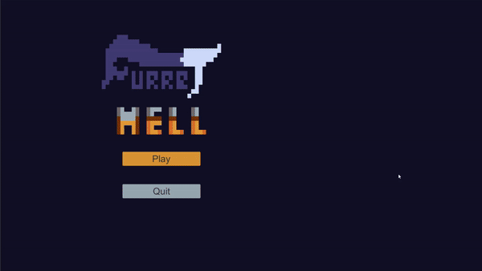

# FDV-events

## Actividad Eventos

Se crea la ui del menu principal y eventos en los botones para iniciar el juego

existen eventos al recoger monedas y el diamante

cuando se recolecta todas las monedas se desbloquea la puerta del nivel

cuando se recolecta el diamante el jugador lanza el evento que el gamemanager dara como victoria y retornara al menu principal

